# Materi Presentasi Sistem AlfarFID
### *Centralized RFID Sterilization & Garment Tracking System*

Dokumen ini disusun sebagai panduan dan bahan presentasi (*pitch deck / executive presentation*) untuk mendemonstrasikan kapabilitas sistem **AlfarFID** dalam mengelola rantai sterilisasi pakaian *cleanroom*, pemantauan keausan tag RFID UHF, sinkronisasi multi-fasilitas (lintas kota), dan kepatuhan audit regulasi farmasi/medis.

---

## 📑 Daftar Isi Presentasi

1. [Slide 1: Portal Akses & Keamanan Multi-Role](#slide-1-portal-akses--keamanan-multi-role)
2. [Slide 2: Pusat Kontrol & Monitoring Realtime (Dashboard)](#slide-2-pusat-kontrol--monitoring-realtime-dashboard)
3. [Slide 3: Manajemen Perangkat Reader RFID (Multi-Plant IoT)](#slide-3-manajemen-perangkat-reader-rfid-multi-plant-iot)
4. [Slide 4: Early Warning System & Manajemen Alerts (FR-03)](#slide-4-early-warning-system--manajemen-alerts-fr-03)
5. [Slide 5: Master Data Garment & Tag RFID UHF (FR-04)](#slide-5-master-data-garment--tag-rfid-uhf-fr-04)
6. [Slide 6: Sirkulasi Pintar — Pindah Tag & Ganti Tag (FR-19)](#slide-6-sirkulasi-pintar--pindah-tag--ganti-tag-fr-19)
7. [Slide 7: Pelacakan Sterilisasi Realtime (Scan Events)](#slide-7-pelacakan-sterilisasi-realtime-scan-events)
8. [Slide 8: Analitik, Tren Autoclave & Prediksi Pensiun (FR-07/16/17)](#slide-8-analitik-tren-autoclave--prediksi-pensiun-fr-071617)
9. [Slide 9: Audit Trail Terintegrasi & Kepatuhan Regulasi (FR-10)](#slide-9-audit-trail-terintegrasi--kepatuhan-regulasi-fr-10)
10. [Slide 10: Manajemen Pengguna & Hak Akses Berjenjang (FR-09)](#slide-10-manajemen-pengguna--hak-akses-berjenjang-fr-09)

---

## Slide 1: Portal Akses & Keamanan Multi-Role

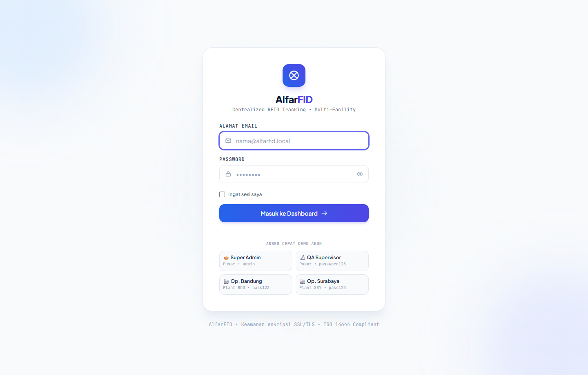

### 📌 Poin Penjelasan untuk Presentasi:
* **Autentikasi Terenkripsi**: Pengamanan sesi login menggunakan hashing standar industri (`Bcrypt`) dan enkripsi jalur komunikasi SSL/TLS (HTTPS).
* **Role-Based Access Control (RBAC)**: Pemisahan hak akses antara **Super Admin**, **QA Supervisor**, **Operator Pabrik Bandung**, dan **Operator Pabrik Surabaya**.
* **Kemudahan Akses Demo**: Dilengkapi tombol akses cepat 1-klik untuk pengujian berbagai peran pengguna secara instan.

---

## Slide 2: Pusat Kontrol & Monitoring Realtime (Dashboard)

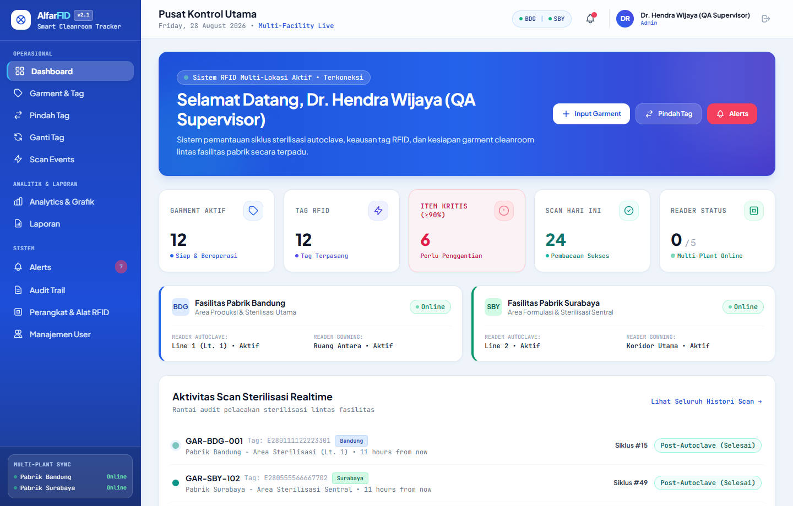

### 📌 Poin Penjelasan untuk Presentasi:
* **Visibilitas Operasional Komprehensif**: Memberikan ringkasan eksekutif secara instan mengenai jumlah *Garment Aktif*, *Tag RFID Terpasang*, *Item Kritis (&ge;90%)*, *Scan Hari Ini*, dan *Status Reader Online*.
* **Sinkronisasi Multi-Fasilitas (Bandung & Surabaya)**: Menampilkan status reader autoclave dan gowning di setiap pabrik secara berdampingan dalam satu layar pusat.
* **Lini Masa Sterilisasi Realtime**: Menampilkan aktivitas pembacaan barcode RFID detik per detik lengkap dengan label pembeda lokasi (*Bandung vs Surabaya*), tipe tahap (*Pre-Autoclave, Post-Autoclave, Gowning*), dan nomor siklus sterilisasi.

---

## Slide 3: Manajemen Perangkat Reader RFID (Multi-Plant IoT)

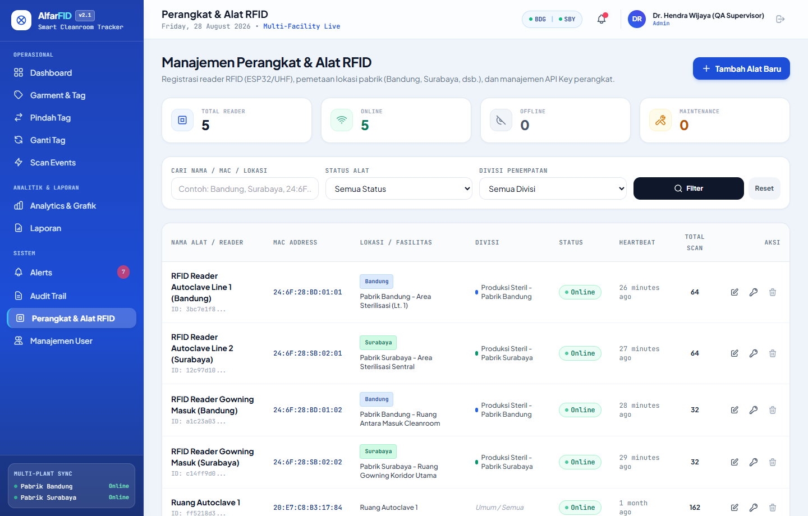

### 📌 Poin Penjelasan untuk Presentasi:
* **Skalabilitas Perangkat IoT**: Mampu mengelola puluhan hingga ratusan reader ESP32 UHF yang tersebar di berbagai kota/fasilitas pabrik.
* **Otomatisasi API Key Perangkat**: Setiap alat baru secara otomatis diberikan kunci otentikasi unik (`af_dev_...`) yang divalidasi lewat HTTP Header (`X-Device-Mac` & `X-Api-Key`).
* **Pemantauan Kesehatan Perangkat (Heartbeat)**: Memantau status *Online*, *Offline*, atau *Maintenance* serta waktu kontak terakhir setiap alat pembaca.

---

## Slide 4: Early Warning System & Manajemen Alerts (FR-03)

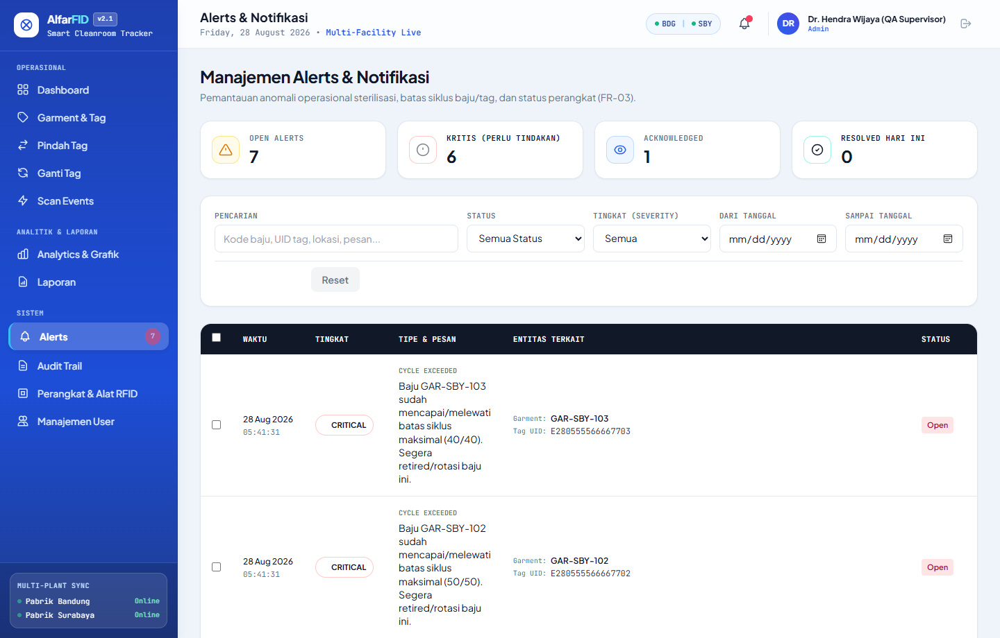

### 📌 Poin Penjelasan untuk Presentasi:
* **Pencegahan Risiko Kegagalan Sterilisasi**: Sistem otomatis mendeteksi ketika baju telah mencapai ambang batas kritis (90% & 100% siklus) agar tidak terjadi kontaminasi cleanroom.
* **Alur Penanganan Alert Terstruktur**: Dilengkapi aksi **Acknowledge** (diketahui operator) dan **Resolve** (diselesaikan dengan catatan petugas & stempel waktu).
* **Aksi Massal (*Bulk Actions*)**: Mempercepat proses pembersihan notifikasi rutin dengan aksi massal terverifikasi.

---

## Slide 5: Master Data Garment & Tag RFID UHF (FR-04)

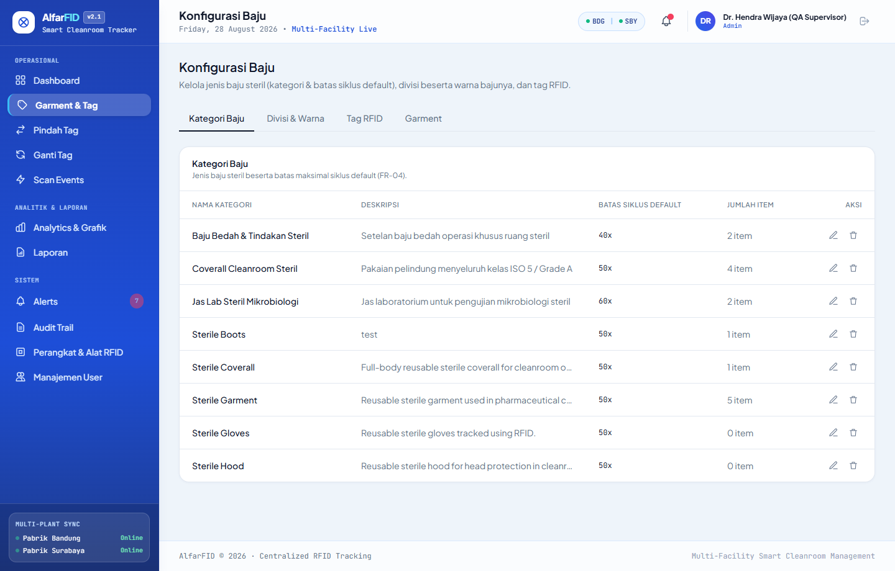

### 📌 Poin Penjelasan untuk Presentasi:
* **Dua Siklus Hidup Terpisah**: Siklus baju (rata-rata 40–60x autoclave) dan umur tag silikon RFID (hingga 200x) dihitung dan dikelola secara mandiri.
* **Pembeda Visual Warna Divisi**: Pengelompokan baju berdasarkan divisi/area kerja (misal: *Produksi Steril Bandung [Biru], Surabaya [Hijau], QC [Kuning]*).
* **Klasifikasi Zona Siklus**: Indikator warna otomatis: **Aman (Hijau)**, **Waspada 90% (Kuning)**, dan **Kritis &ge;100% (Merah)**.

---

## Slide 6: Sirkulasi Pintar — Pindah Tag & Ganti Tag (FR-19)

````carousel
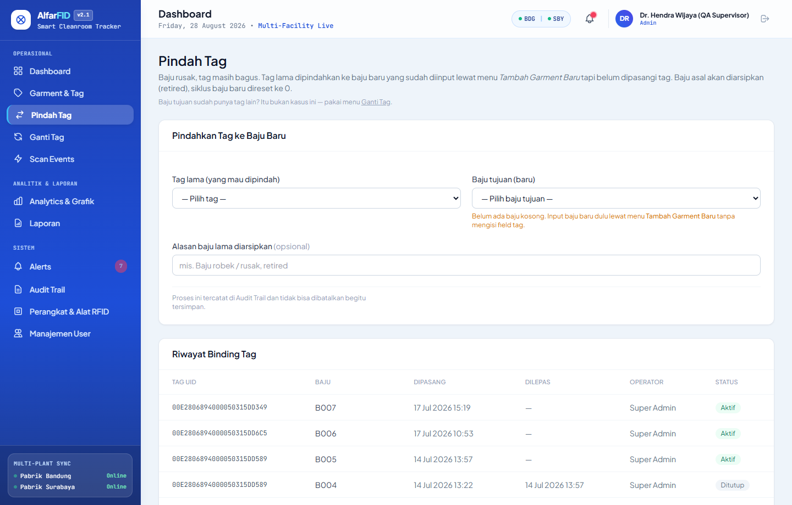
<!-- slide -->
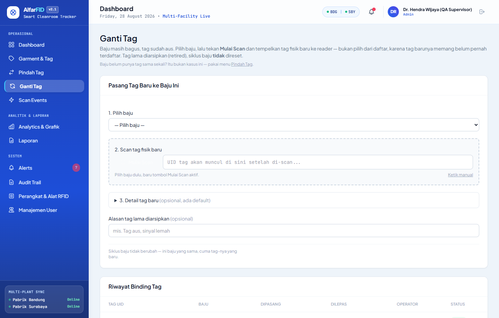
````

### 📌 Poin Penjelasan untuk Presentasi:
* **Skenario A — Pindah Tag**: Solusi saat kain baju robek/rusak tetapi tag RFID masih memiliki sisa umur pakai. Tag dipindahkan ke baju baru sehingga menghemat biaya pengadaan tag.
* **Skenario B — Ganti Tag**: Solusi saat tag RFID mencapai batas aus (200 siklus) tetapi baju masih layak pakai. Baju dipasangkan tag baru tanpa mereset riwayat siklus baju aslinya.
* **Efisiensi Anggaran Operasional**: Mengeliminasi pemborosan aset dan memastikan setiap komponen dimanfaatkan hingga batas maksimal yang aman.

---

## Slide 7: Pelacakan Sterilisasi Realtime (Scan Events)

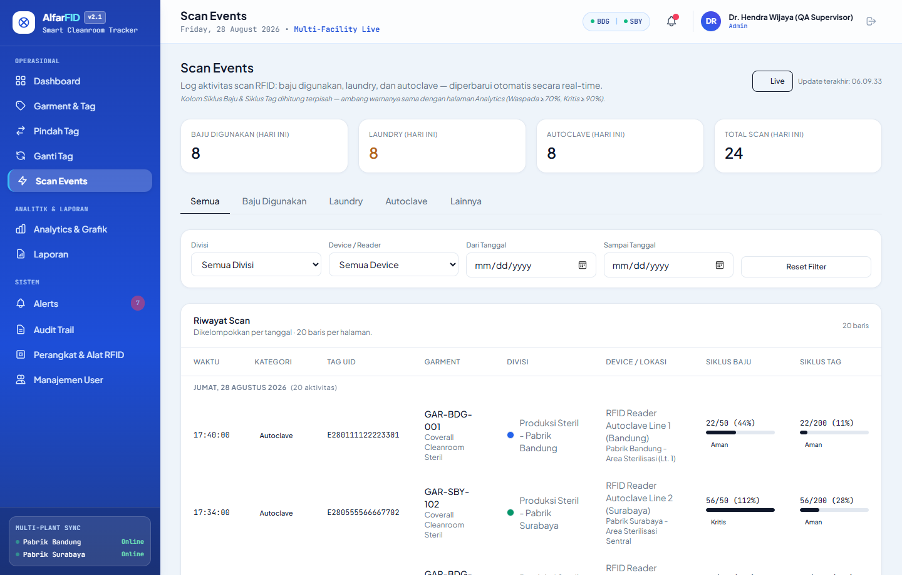

### 📌 Poin Penjelasan untuk Presentasi:
* **Rantai Pengawasan Sterilisasi Lengkap (*Chain of Custody*)**: Melacak status pergerakan baju dari `siap_digunakan` $\rightarrow$ `sedang_dipakai` $\rightarrow$ `pre_autoclave` $\rightarrow$ `post_autoclave`.
* **Proteksi Anti Stray-Read (Dwell Time)**: Algoritma cerdas yang menolak pembacaan prematur atau duplikat scan tidak sengaja saat baju masih berada di ruang kerja atau ruang mesin.
* **Pencatatan Multi-Lokasi Akurat**: Menyimpan timestamp mikrodetik, nama reader, dan lokasi fisik tempat pembacaan dilakukan.

---

## Slide 8: Analitik, Tren Autoclave & Prediksi Pensiun (FR-07/16/17)

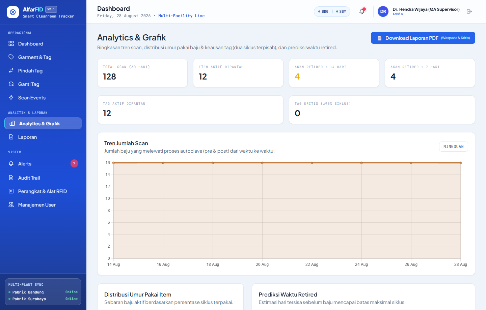

### 📌 Poin Penjelasan untuk Presentasi:
* **Analisis Utilisasi Mesin**: Grafik tren beban sterilisasi harian dan mingguan untuk optimasi jadwal operasional pabrik.
* **Prediksi Pensiun Garment (*Replacement Forecasting*)**: Memberikan rekomendasi estimasi kebutuhan pengadaan baju baru sebelum stok baju steril di ruang bersih habis.
* **Ekspor Laporan PDF**: Dilengkapi fitur cetak laporan resmi untuk kebutuhan *review* berkala manajemen mutu.

---

## Slide 9: Audit Trail Terintegrasi & Kepatuhan Regulasi (FR-10)

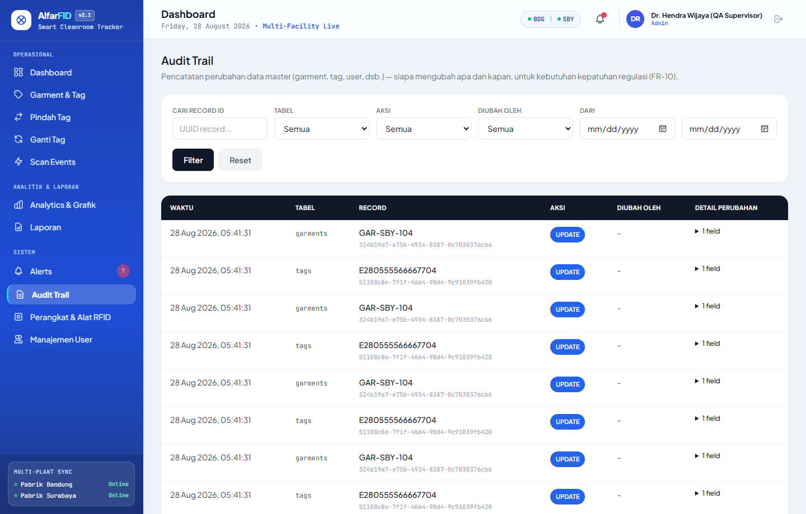

### 📌 Poin Penjelasan untuk Presentasi:
* **Otomatisasi Audit Tingkat Basis Data**: Setiap penambahan (*insert*), perubahan (*update*), dan penghapusan (*delete*) data dicatat otomatis dengan perbandingan *Old Value* vs *New Value*.
* **Identifikasi Pengguna Akurat**: Mengaitkan setiap perubahan data dengan identitas user yang sedang login (`changed_by`) dan stempel waktu presisi.
* **Perlindungan Data Sensitif**: Otomatis menyaring informasi kredensial seperti hash password agar tidak terekam ke log terbuka.

---

## Slide 10: Manajemen Pengguna & Hak Akses Berjenjang (FR-09)

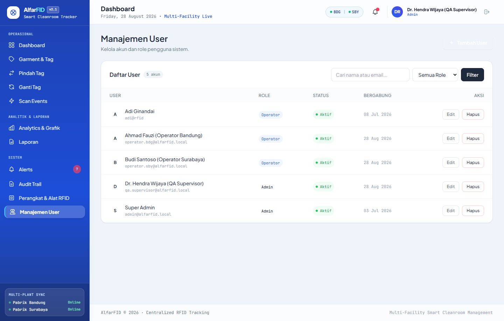

### 📌 Poin Penjelasan untuk Presentasi:
* **Struktur Akun Terdistribusi**: Mengelola akun untuk operator lokal Bandung, operator Surabaya, supervisor QA, dan administrator pusat.
* **Kontrol Status Keaktifan**: Kemudahan menonaktifkan akun operator yang sudah mutasi atau tidak bertugas secara instan demi keamanan data.
